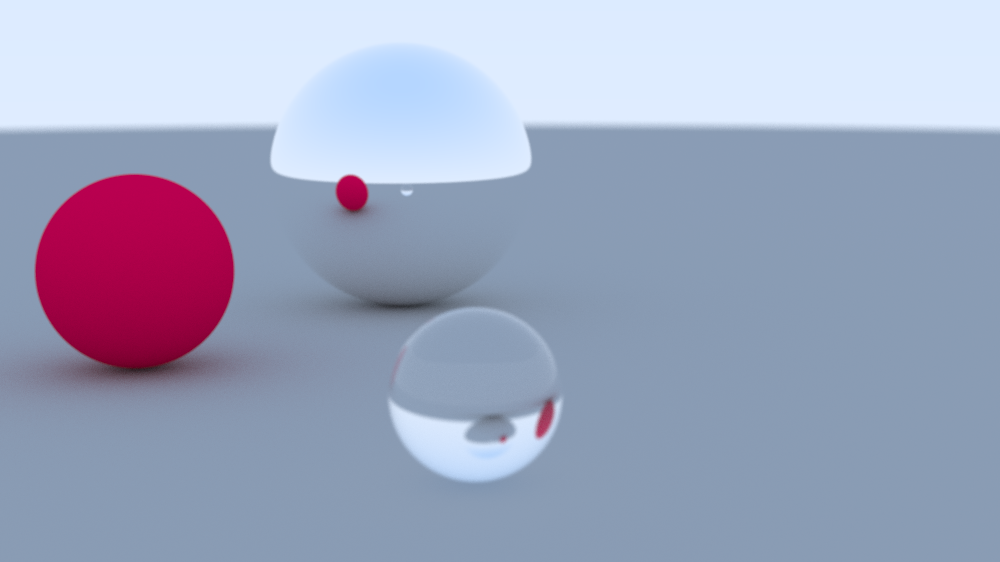
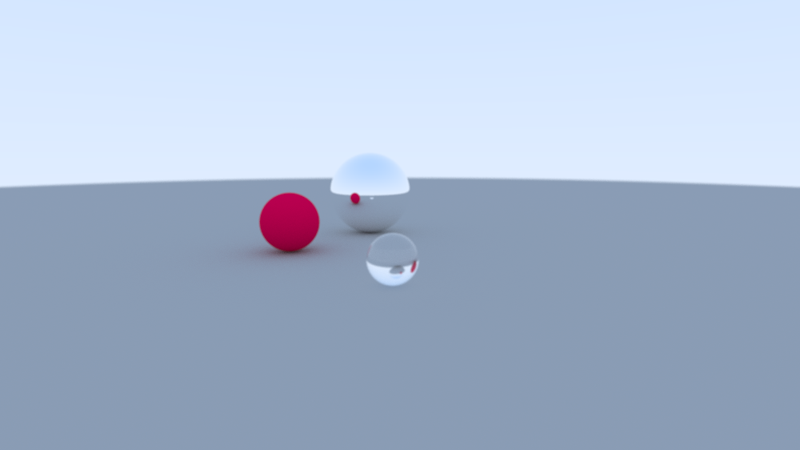
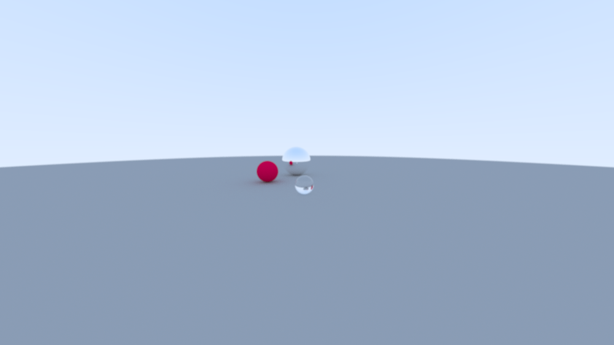
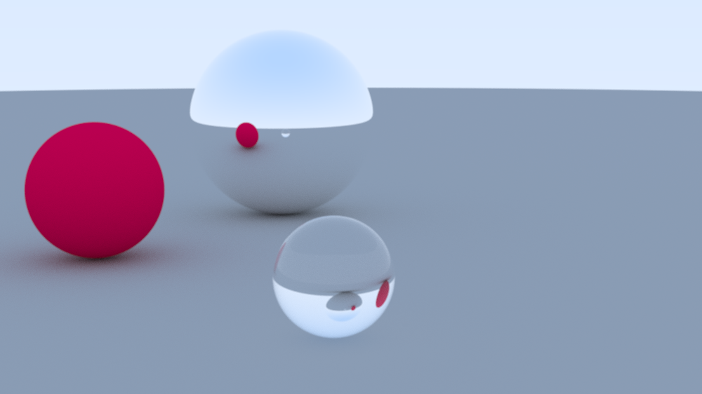
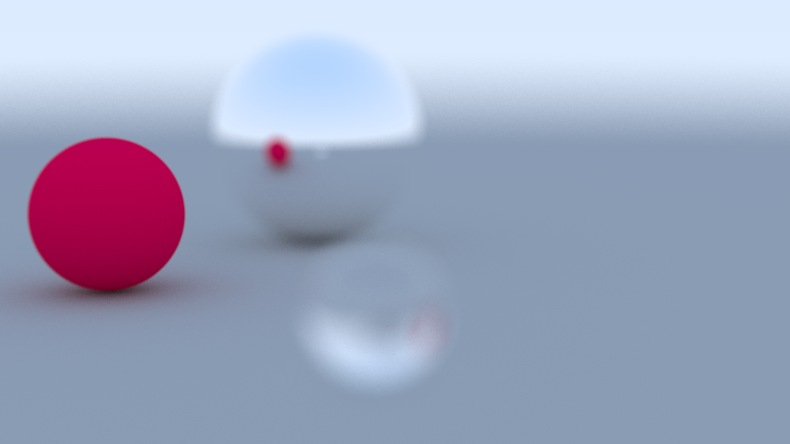
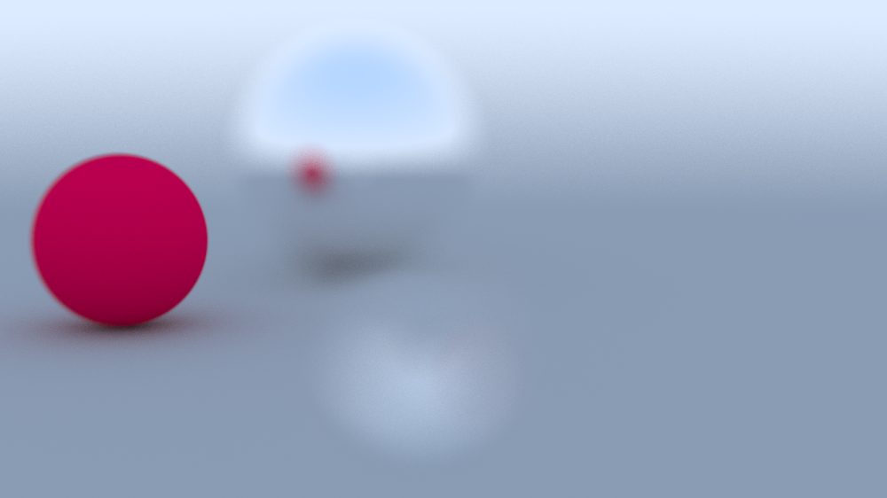

# Ray Tracing Rendering

This is a basic ray tracing project written in C++. It simulates the concept of tracing light rays to objects to illuminate and project shadows. Currently, this project features:

1. Light diffusion for metallic (reflective) and lambertian (matte) surfaces
2. Reflectance and refraction of dielectric materials (water, glass)
3. Camera positioning and Field-of-View (FOV)
4. Anti-aliasing

## Components

### Camera Class

This class controls all aspects regarding camera positioning and rendering of the image, including field-of-view (FOV), depth-of-field effects, and pixel-sampling to create an anti-aliasing effect.

#### Field of view

Field of view determines how much can be seen in the image at once and is set by the `camera.vfov` parameter, defining the vertical field of view of the camera. Here are three images displaying varying levels of field of view
| vfov=20 | vfov=50 | vfov=90 |
| - | - | - |
|  |  |  |

#### Depth of field

Depth of field, or defocus blur, is simulated by randomizing ray generation from a disk centered at our camera center, with the radius of this disk determined by the focus distance of the camera and the range of ray angles the viewport's center pixel color is calculated from.

This provides the effect of having varying sizes of aperture lenses in photography where blurring is used to give a sense of depth to an image.

Here are three images, from left to right, where the first has no defocus angle and a focus distance of 10, the second has a focus distance of 10 and defocus angle of 5, and the third has a focus distance of 10 and defocus angle of 10:
| No defocus blur| Defocus angle = 5| Defocus angle = 10|
| - | - | - |
|  |  |  |

<!-- 

    
    
    

 -->

#### Anti-aliasing

#### Pixel Sampling

The `camera.samples_per_pixel` parameter controls how many samples we take when averaging a pixel's rendered color. Having this parameter too low introduces more noise in the final rendered image as seen in the following image rendered with the parameter set to 25:

Increasing this parameter to 100 produces a significant improving in the rendered image:

---

### Material Class

This class provides the structure for all classes that inherit from it, and only provides the scatter function that computes the scattering of rays that hit objects. There are three kinds of materials defined:

1. Lambertian
2. Metallic
3. Dielectric

---

### Hittable Class

---

### Future changes

1. Different anti-aliasing methods
   1. gaussian blur
2. Add different shapes
   1. rectangle
3. Add models with triangle meshes
4. Parallelizing the rendering process with threads or cuda

